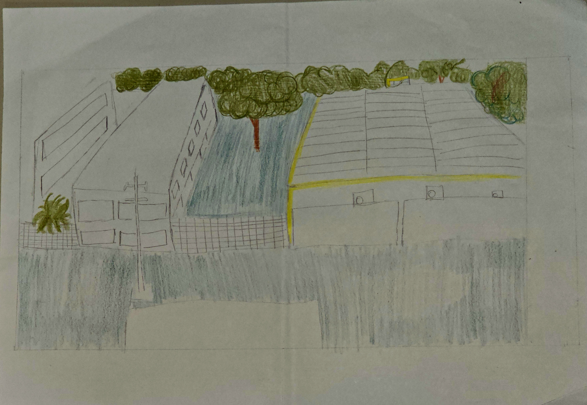
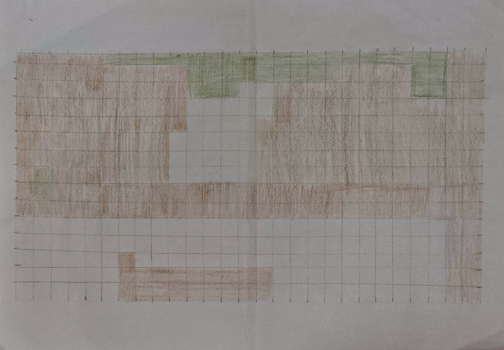
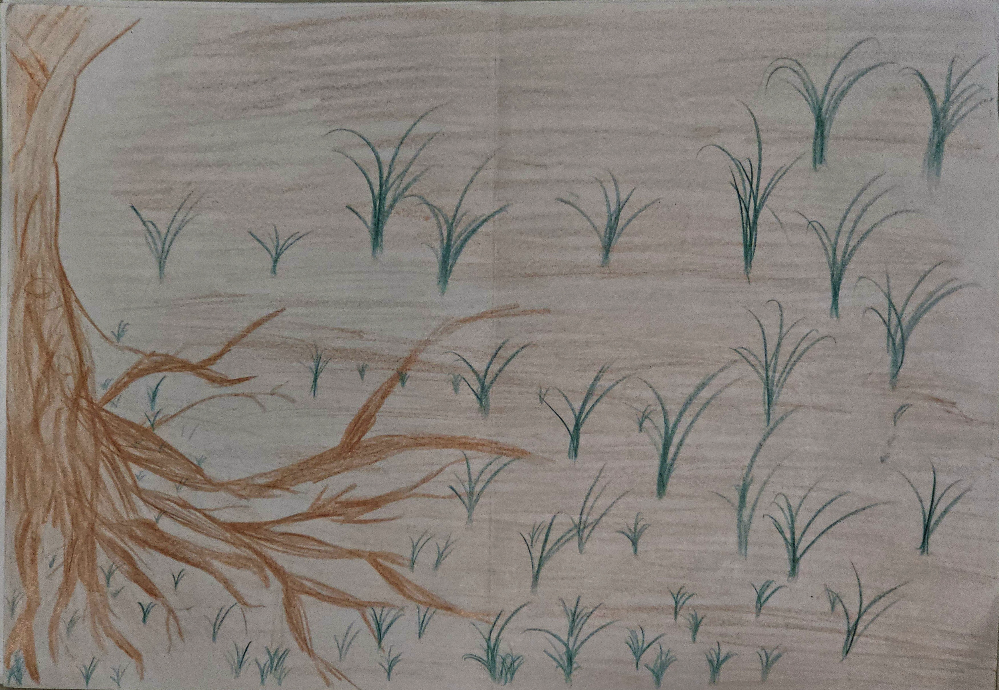

## Exercício 1:

### Parte 1:

{alt="Paisagem da janela atrás do Niate CFCH/CCSA para o CCSA"}

### Parte 2: 

{alt="Exercício de transmutação"}

Matriz antrópica em marrom e fragmento em verde. Os quadrantes brancos são aqueles com maior presença de grama. (Ainda não sei se nesse contexto seria um corredor, porque nesse recorte não conecta o fragmento, mas sei que ao lado tem outra área com poucas árvores e que poderia configurar um corredor para determinadas espécies)

### Parte 3:

{alt="Lente biológica: Paisagem do ponto de vista de um gafanhoto"}

### Questões:

1.  Ao aumentar o tamanho do **grão** (Parte 2), você perdeu informações que seriam vitais para a conservação de alguma espécie específica? Há uma perda de informações, pois uma homogeneização de uma parte considerável do ambiente que é mais complexo do que aparenta ser no caso da parte 2.

2.  Como a **conectividade funcional** mudou entre a sua visão humana e a visão do “gafanhoto”? Elementos que eram barreiras continuam sendo? A conectividade funcional modificou, uma vez que a grama passou a ser matriz e o que antes entendi como sendo intransponível ou de difícil acesso, tornou-se o ambiente predominante dessa espécie.

3.  Você consegue identificar algum **distúrbio** (natural ou antrópico) que foi o responsável por criar essa heterogeneidade que você desenhou? Como é área da UFPE, existe um distúrbio causada por ação antrópica, tanto pelos prédios, quanto pela passagem de alunos e funcionários da universidade.
